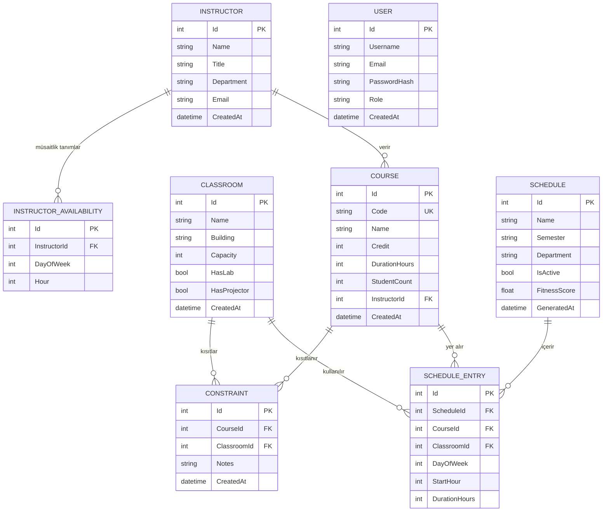

# SmartScheduler — Veritabanı Şema Tasarımı

**Veritabanı:** PostgreSQL 16
**ORM:** Entity Framework Core 9 (Code-First)
**Güncel Sprint:** 4 Final
**Migration Sayısı:** 8

| Migration | İçerik |
|-----------|--------|
| `20260506_InitialCreate` | Temel şema |
| `20260512_Sprint2_Auth_CRUD` | Kullanıcı + auth |
| `20260517_Sprint3_Constraints_SeedData` | Kısıtlar + seed |
| `20260520_Sprint3_InstructorAvailability` | Müsaitlik |
| `20260603_Sprint4_DataFix_CapacityAndAvailability` | Veri düzeltme |
| `20260603_Sprint4_VariableCourseDuration` | DurationHours alanı |
| `20260603_Sprint4_RebalanceInstructorAssignments` | Hoca-ders dengeleme |
| `20260603_Sprint4_AddDepartmentToSchedule` | **Schedule.Department** |

---

## ER Diyagramı (Mermaid)



---

## Tablo Detayları

### Instructor (Hoca)
```sql
CREATE TABLE "Instructors" (
    "Id"         SERIAL PRIMARY KEY,
    "Name"       VARCHAR(100) NOT NULL,
    "Title"      VARCHAR(50)  NOT NULL,   -- Prof. Dr., Doç. Dr., Dr. Öğr. Üyesi
    "Department" VARCHAR(100) NOT NULL,
    "Email"      VARCHAR(150) UNIQUE NOT NULL,
    "CreatedAt"  TIMESTAMP WITH TIME ZONE DEFAULT NOW()
);
```

### Course (Ders)
```sql
CREATE TABLE "Courses" (
    "Id"            SERIAL PRIMARY KEY,
    "Code"          VARCHAR(20)  UNIQUE NOT NULL,
    "Name"          VARCHAR(150) NOT NULL,
    "Credit"        INT NOT NULL CHECK ("Credit" BETWEEN 1 AND 6),
    "DurationHours" INT NOT NULL DEFAULT 2,  -- haftalık tek oturum süresi (1–6 saat)
    "StudentCount"  INT NOT NULL DEFAULT 0,
    "InstructorId"  INT NOT NULL REFERENCES "Instructors"("Id"),
    "CreatedAt"     TIMESTAMP WITH TIME ZONE DEFAULT NOW()
);
```

### Classroom (Sınıf)
```sql
CREATE TABLE "Classrooms" (
    "Id"           SERIAL PRIMARY KEY,
    "Name"         VARCHAR(50) NOT NULL,
    "Building"     VARCHAR(100),
    "Capacity"     INT NOT NULL CHECK ("Capacity" > 0),
    "HasLab"       BOOLEAN NOT NULL DEFAULT FALSE,
    "HasProjector" BOOLEAN NOT NULL DEFAULT TRUE,
    "CreatedAt"    TIMESTAMP WITH TIME ZONE DEFAULT NOW()
);
```

### Schedule (Program)
```sql
CREATE TABLE "Schedules" (
    "Id"           SERIAL PRIMARY KEY,
    "Name"         VARCHAR(150) NOT NULL,
    "Semester"     VARCHAR(50)  NOT NULL,
    "Department"   TEXT         NOT NULL DEFAULT '',  -- Sprint 4: bölüm adı
    "IsActive"     BOOLEAN NOT NULL DEFAULT FALSE,
    "FitnessScore" DOUBLE PRECISION,
    "GeneratedAt"  TIMESTAMP WITH TIME ZONE DEFAULT NOW()
);
```

### ScheduleEntry (Program Girdisi)
```sql
CREATE TABLE "ScheduleEntries" (
    "Id"             SERIAL PRIMARY KEY,
    "ScheduleId"     INT NOT NULL REFERENCES "Schedules"("Id") ON DELETE CASCADE,
    "CourseId"       INT NOT NULL REFERENCES "Courses"("Id"),
    "ClassroomId"    INT NOT NULL REFERENCES "Classrooms"("Id"),
    "DayOfWeek"      INT NOT NULL CHECK ("DayOfWeek" BETWEEN 0 AND 4),
    "StartHour"      INT NOT NULL CHECK ("StartHour" BETWEEN 8 AND 18),
    "DurationHours"  INT NOT NULL DEFAULT 2
);
```

### Constraint (Kısıt)
```sql
CREATE TABLE "Constraints" (
    "Id"          SERIAL PRIMARY KEY,
    "CourseId"    INT NOT NULL REFERENCES "Courses"("Id") ON DELETE CASCADE,
    "ClassroomId" INT NOT NULL REFERENCES "Classrooms"("Id") ON DELETE CASCADE,
    "Notes"       TEXT,
    "CreatedAt"   TIMESTAMP WITH TIME ZONE DEFAULT NOW(),
    UNIQUE ("CourseId", "ClassroomId")
);
```

### InstructorAvailability (Müsaitlik)
```sql
CREATE TABLE "InstructorAvailabilities" (
    "Id"           SERIAL PRIMARY KEY,
    "InstructorId" INT NOT NULL REFERENCES "Instructors"("Id") ON DELETE CASCADE,
    "DayOfWeek"    INT NOT NULL CHECK ("DayOfWeek" BETWEEN 0 AND 4),
    "Hour"         INT NOT NULL CHECK ("Hour" BETWEEN 8 AND 18),
    UNIQUE ("InstructorId", "DayOfWeek", "Hour")
);
```

### User (Kullanıcı)
```sql
CREATE TABLE "Users" (
    "Id"           SERIAL PRIMARY KEY,
    "Username"     VARCHAR(50)  UNIQUE NOT NULL,
    "Email"        VARCHAR(150) UNIQUE NOT NULL,
    "PasswordHash" VARCHAR(255) NOT NULL,  -- BCrypt
    "Role"         VARCHAR(20)  NOT NULL DEFAULT 'User',
    "CreatedAt"    TIMESTAMP WITH TIME ZONE DEFAULT NOW()
);
```

---

## EF Core Entity Sınıfları (güncel)

### Schedule.cs
```csharp
public class Schedule
{
    public int Id { get; set; }
    public string Name { get; set; } = string.Empty;
    public string Semester { get; set; } = string.Empty;
    public string Department { get; set; } = string.Empty;  // Sprint 4
    public bool IsActive { get; set; }
    public double? FitnessScore { get; set; }
    public DateTime GeneratedAt { get; set; } = DateTime.UtcNow;
    public ICollection<ScheduleEntry> Entries { get; set; } = [];
}
```

### Course.cs
```csharp
public class Course
{
    public int Id { get; set; }
    public string Code { get; set; } = string.Empty;
    public string Name { get; set; } = string.Empty;
    public int Credit { get; set; }
    public int DurationHours { get; set; } = 2;  // Sprint 4
    public int StudentCount { get; set; }
    public int InstructorId { get; set; }
    public Instructor? Instructor { get; set; }
    public DateTime CreatedAt { get; set; } = DateTime.UtcNow;
    public ICollection<ScheduleEntry> ScheduleEntries { get; set; } = [];
    public ICollection<Constraint> Constraints { get; set; } = [];
}
```

---

## Seed Data (HasData)

Migration'larla otomatik yüklenen veriler (EnsureCreated/Migrate sırasında uygulanır):

| Tablo | Kayıt Sayısı | Notlar |
|-------|-------------|--------|
| Instructors | 15 | 5 farklı bölüm (BM, EEM, Matematik, YM, Endüstri) |
| Courses | 20 | CS301–CS320, 1–4 saatlik dersler |
| Classrooms | 15 | D-101, LAB-1..4, AMFİ-1..2 vb. |
| Constraints | 21 | Lab/kapasite kısıtları |
| InstructorAvailabilities | 60 | Hoca 1 ve 3 için tam hafta |
| Users | 0 | HasData yok — API ile oluşturulur |
| Schedules | 0 | API ile oluşturulur |

**Sprint 4 hoca-ders yeniden dengeleme:** CS304 Yapay Zeka → Mustafa Öztürk, CS307 Veri Yapıları → Mehmet Demir, CS309 Web Programlama → Zeynep Arslan ve diğer 6 ders yeniden atandı.

---

*DevArchitechs · SmartScheduler · Veritabanı Şema v4.0 (Sprint 4 Final)*
